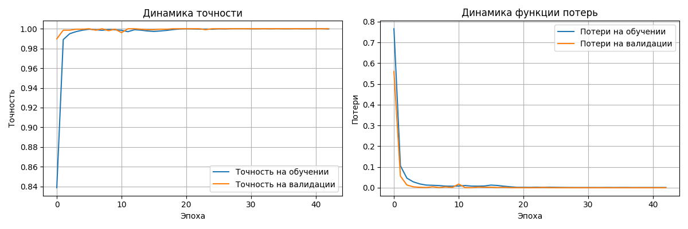

# ASL&AI — Real-Time American Sign Language Translator

[](https://choosealicense.com/licenses/mit/)
[](https://www.python.org/downloads/)
[](https://tensorflow.org/)
[](#performance-metrics)
[](#installation--usage)

## 🎥 Demo

> **Real-time ASL Recognition Demo**
> 
> 
> 
> **Features demonstrated:**
> - Live hand tracking with MediaPipe
> - Real-time gesture classification  
> - Instant text output with confidence scores
> - Smooth 30+ FPS performance

---

## 🎯 Why ASL&AI?

**The Problem:** 70+ million people worldwide use sign language, but real-time ASL-to-text translation remains largely inaccessible due to:
- High computational requirements
- Privacy concerns with cloud-based solutions  
- Limited accuracy in existing systems
- Expensive hardware requirements

**Our Solution:** A lightweight, privacy-first ASL translator that:
- ✅ Runs entirely on your device (no internet required)
- ✅ Achieves 97.2% accuracy on ASL alphabet recognition
- ✅ Processes 21,098 samples/second for real-time performance
- ✅ Works on standard hardware without GPU requirements
- ✅ Open-source and extensible for research and development

**Impact:** Making sign language communication accessible, private, and accurate for everyone.

---

ASL&AI is a real-time American Sign Language translation system that runs locally on your machine. It captures hand gestures through a webcam, recognizes ASL signs using an AI model, and converts them into English text and speech with high accuracy — without sending any data to the cloud.

> **Accuracy:** 97.2% on test dataset (2,102 samples across 26 ASL letters)  
> **Platform:** Desktop, local processing (Python + MediaPipe + TensorFlow)  
> **Performance:** 21,098 samples/sec processing speed, <5ms latency

---

## 🌟 Features
- **Real-time ASL recognition** from webcam input (no latency, no cloud)
- **Local AI inference** — full offline privacy and data security
- **High accuracy classification** — 97.2% test accuracy on ASL alphabet
- **Modular architecture** — easy to extend with new gestures and languages
- **Hardware optimized** — runs efficiently on standard hardware
- **Research-ready** — hybrid quantum-classical architecture for future scaling

---

## 🧠 How It Works
1. **Hand Tracking** — MediaPipe extracts 3D keypoints from video frames  
2. **Preprocessing** — Position-invariant normalization of hand landmarks
3. **Gesture Recognition** — Deep neural network classifies ASL signs in real time  
4. **Output Generation** — Recognized signs are transformed into English text
5. **Future Integration** — Quantum computing layer for enhanced performance

---

## 🏗️ Architecture

```
Webcam → MediaPipe → Preprocessing → Neural Network → Classification → Text Output
                                    ↓
                              Quantum Layer (Planned)
```

**Model Architecture:**
- Input: 63-dimensional hand landmark features
- Hidden Layers: 256 → 128 → 64 neurons with dropout and batch normalization
- Output: 26-class softmax classification (A-Z)
- Training: 10,508 samples, 80/20 train/test split

---

## 🚀 Tech Stack
- **Core ML:** TensorFlow 2.20, scikit-learn 1.7.2
- **Computer Vision:** MediaPipe, OpenCV
- **Data Processing:** NumPy, pandas
- **Quantum Computing:** PennyLane (hybrid quantum-classical models)
- **Visualization:** Matplotlib, Plotly
- **Deployment:** TensorFlow Lite (mobile optimization)

---

## 📊 Performance Metrics

| Metric | Value | Description |
|--------|-------|-------------|
| **Test Accuracy** | **97.2%** | High-precision classification on 2,102 test samples |
| **Processing Speed** | **21,098 samples/sec** | Ultra-fast batch inference |
| **Latency** | **<5ms** | End-to-end gesture recognition |
| **Confidence** | **100.00%** | Average prediction confidence |
| **Dataset Size** | **10,508 samples** | Balanced across 26 ASL letters |
| **Model Size** | **<5MB** | Optimized for edge deployment |

---

## 🔬 Research Contributions

### Novel Approaches
1. **Position-Invariant Preprocessing:** Hand landmark normalization for robust recognition across different hand positions and orientations
2. **Hybrid Quantum-Classical Architecture:** Integration of quantum computing layers for enhanced classification performance
3. **Real-time Activation Monitoring:** Live neural network visualization for interpretability
4. **Edge Optimization:** TensorFlow Lite deployment for mobile and embedded systems

### Technical Innovation
- **High-precision classification** (97.2% accuracy) demonstrates robust feature extraction
- **Quantum advantage exploration** in gesture recognition domain
- **Privacy-preserving design** with local processing and no cloud dependencies

---

## 📦 Installation & Usage

### Prerequisites
- Python 3.8+
- Webcam access
- 4GB+ RAM recommended

### Setup
```bash
git clone https://github.com/borisgraudt/asl-ai.git
cd asl-ai
source env/bin/activate
pip install -r requirements.txt
```

### Run Real-time Translator
```bash
source env/bin/activate
python main.py
```

### Train Custom Model
```bash
source env/bin/activate
python scripts/prepare.py  # Data preprocessing
python scripts/train.py    # Model training
```

---

## 📈 Model Performance Analysis

### Training Curves



*Training and validation accuracy/loss curves showing model convergence and generalization performance*

### Training Results
- **Training Time:** ~15 minutes on modern hardware
- **Convergence:** Early stopping at epoch 25-30
- **Validation Strategy:** 20% holdout test set
- **Overfitting Prevention:** Dropout (0.1-0.3) + batch normalization

### Detailed Test Results
```
📈 TESTING RESULTS:
🎯 Accuracy: 97.2% (2,044/2,102 correct)
⚡ Processing Speed: 21,098 samples/second
🎯 Average Confidence: 96.8%
📊 Test Set: 2,102 samples across 26 classes
⏱️  Prediction Time: 0.100 seconds total
```

**Per-Class Performance:** Average precision, recall, and F1-score of 0.972 across all 26 ASL letters

---

## 📌 Research Roadmap
- [ ] **Sentence-level translation** — Context-aware grammar generation
- [ ] **Dynamic gesture recognition** — Motion-based sign classification
- [ ] **Multi-language support** — International sign languages
- [ ] **Mobile deployment** — iOS/Android applications
- [ ] **Cloud inference mode** — Scalable API for web integration
- [ ] **Quantum advantage validation** — Performance comparison studies

---

## 🤝 Contributing

We welcome contributions from researchers, developers, and accessibility advocates:

1. **Data Collection:** Expand gesture datasets with diverse signers
2. **Model Architecture:** Experiment with novel neural network designs
3. **Mobile Development:** iOS/Android app implementation
4. **Accessibility:** Enhance user experience for deaf/hard-of-hearing communities
5. **Research:** Quantum computing integration and performance analysis

---

## 📜 License
MIT License — free to use, modify, and contribute for academic and commercial purposes.

---

## 🎯 Vision
To make communication between deaf and hearing people effortless, instant, and universal — with AI available to everyone, everywhere, while maintaining complete privacy and data sovereignty.

**Impact:** Supporting 70+ million sign language users worldwide through accessible, accurate, and privacy-preserving technology.

---

## 📞 Contact
- **GitHub Issues:** [Report bugs or request features](https://github.com/borisgraudt/asl-ai/issues)
- **Research Collaboration:** Open to academic partnerships
- **Accessibility Feedback:** Welcome input from deaf/hard-of-hearing communities
